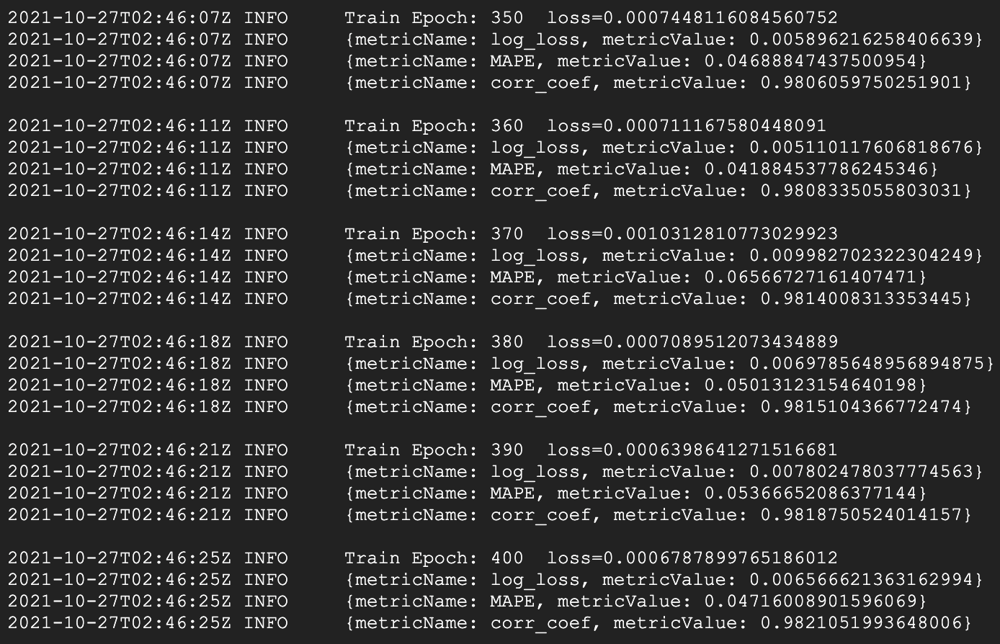

# Stock price prediction with RNN
 
In this project, I trained an RNN model to predict Apple stock price using historic stock price data.

## Keypoints

- The data is stored in `all_Stocks_5yr.csv` which includes 5 years of stock price data for US companies.
- To train the model on a local computer, run `python stock-rnn-prediction.py`.
- A step-by-step notebook is also provided.
- Nowadays, it is very useful to leverage the resources from the cloud. Here, I use the [PyTorch Job](https://github.com/kubeflow/pytorch-operator) operator to train the model on Google Cloud Platform:
  - Since the job is deployed on Kubernetes, it is run in a user-defined container.
  - The Dockerfile to build the container image is available at `/docker/`.
  - The job specifications are stored in `pytorch-job.yaml`
  - On Kubernetes, create the pytorch-job by running `kubectl apply -f pytorch-job.yaml -n <namespace>`.
  - The job can be monitored by checking the logs of the master pod -
    - Be sure to look for the name of the pod with `kubectl get pods -n <namespace>`.
    - In my case, running 'kubectl logs kubectl logs pytorch-stock-rnn-master-0 -n kubeflow' returns the logging info that looks like below:
    - 
